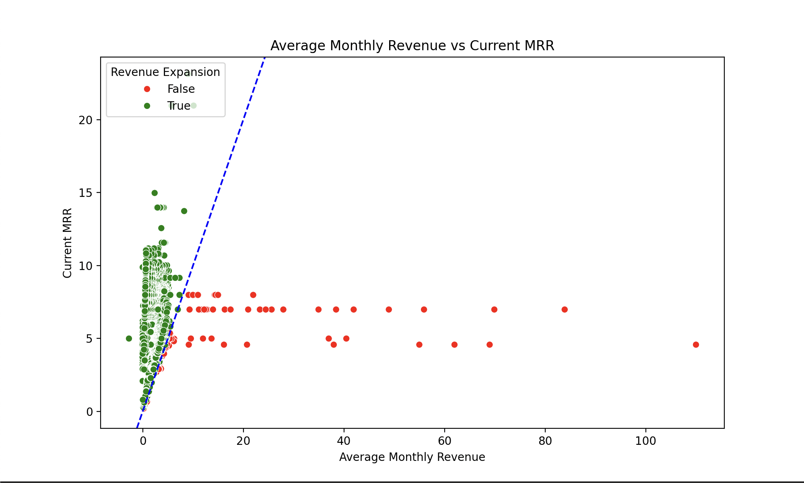
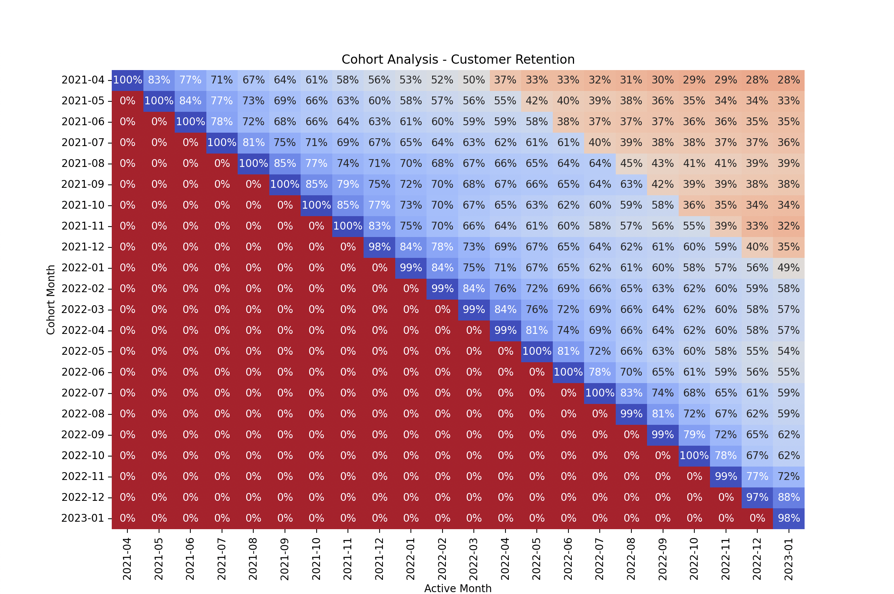

# Retention Analysis Exercise - Results 

## Analysis
In this exercise, I aimed to answer four key questions:

- How does retention vary by geography? or provider?
- Is there evidence of revenue expansion at the customer level?
- How is retention trending for different starting cohorts?
- How does delinquency affect customer retention and revenue?

## Results 
Our findings suggest several key insights about the product and company we are analyzing:

### There is strong upside potential in Africa and APAC, but North America provides the most consistent retentive users

**Methodology:** 
For this analysis, I sought to explore average retention for each user delineated by their provider, continent, and country of origin. By mapping each user's country to a specific continent using a predefined dictionary, we were able to find an additional vector by which we can evaluate our user base. The results of this analysis can be found below: 

**Insights:** 
On an aggregated level, North America shows the strongest average retention on a per-user basis compared to other continents. However, when breaking the analysis down, we can see stark differences within a handful of countries inside each continent. Countries like Senegal see nearly 2.5x the average user retention of inner-region counterparts like The Ivory Coast. A similar story plays out for providers, with Stripe far exceeding the average retention of alternatives like Google. Without further analysis, it's difficult to pinpoint why these differences are so stark. Moving forward, I would suggest investigating a small handful high retention outliers to understand if there is a repeatable process or trend that could be scaled to the rest of its inter-continental or global peers.

### Revenue Ramps Quickly For Low Spend Users
**Methodology:** 
For this analysis, I sought to understand how revenue expansion worked on a per customer level. I first calculated each user's "Expected MRR"— a metric found by dividing each user's total charges by their active months as a paying user. We can then plot if they were subject to revenue growth by comparing this expected MRR to their actual current MRR. If a user's current MRR exceeds their expected MRR, we can intuit that their spend has in fact grown over their active customer period. The results of this analysis can be found in the chart below.

**Insights:** 
Given that the green points (representing users with revenue expansion) are concentrated near the origin, we can assume that customers with lower average monthly revenue are more likely to show revenue expansion. This could suggest that customers that start with a lower spend are more likely to upgrade over time, while users who commit to high spend upfront are likely to shrink costs.

### There is a significant drop-off in retention 12 months after purchase

**Methodology:** 
For this analysis, I grouped each paying user into a cohort based on the month they first converted into the product. I then analyzed how retentive each of these cohorts were on a monthly basis over the period of several years. The results of this analysis can be found in the chart below.

**Insights:** 
There is a consistent dip (>10%) in retention in the 13th month of purchasing for nearly every cohort. This could imply that the product is offering customers favorable annual contracts and terms upfront but not effectively renewing deals. There could be several reasons this is the case, including ineffective proof of value, poor onboarding, a large increase in pricing, and gaps within the skillset of renewing sales reps. This data would suggest that it would be best to further dig into how renewals work for this product.

### Delinquent Users Pay More on Average and Subscribe for Longer

**Methodology:** 
For my final analysis, I wanted to compare some core retention and monetization factors for delinquent and non-delinquent users. To do so, I grouped each paying user into one of the two previously defined buckets, and then evaluated their average paying duration, average MRR, and average total charges. The results of this analysis can be found in the chart below.

**Insights:** 
The delinquent cohort of users saw higher average subscription duration and MRR. There are several reasons this could potentially be the case: the company could be offering extended grace periods or payment plans, the cohort may be a small group of high-value users that purchase a specific tier of product, they could be on long-term contracts that offer a variety of benefits (delayed payments, stronger relationships, etc.), or the company could simply build goodwill for delinquent users, causing them to stick around longer than they would have otherwise. It's worth further analyzing the delinquent customer base by looking at various segments or exploring new/existing retention strategies targeted at the cohort.
